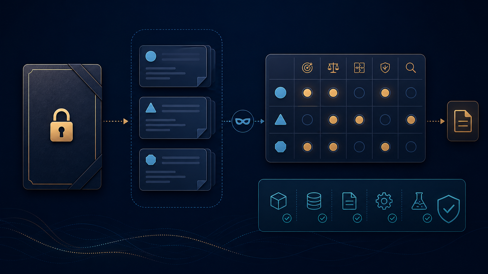

# Russian LLM Bench



> A small, reproducible blind check for Russian-language LLM behavior — with
> the answer key kept out of the model prompt.

This repository is useful as a transparent smoke test before making a larger
benchmark claim. It fixes 20 records, renders the same input for each model,
and scores only the scalar items that the current scorer can justify.

It is deliberately **not** a leaderboard: 10 SLAVA + 10 MERA records are a
diagnostic slice, not a representative evaluation.

## Result at a glance

On the current checked-in slice, `gpt-5.6-terra` leads the scalar comparison at
**14/18**. This is a diagnostic ranking only: 20 records are run, but the two
structured MERA records are excluded from the exact-match total. Read the
[limitations and reproduction path](#reproduce-the-slice) before interpreting
the numbers.

The slice covers two Russian benchmarks:

- [SLAVA](https://huggingface.co/datasets/RANEPA-ai/SLAVA-OpenData-2800-v1)
- [MERA](https://huggingface.co/datasets/ai-forever/MERA)

The goal is not to publish a leaderboard from 20 questions. It is to make a
cheap comparison that can be rerun without leaking answer keys into prompts.

## Current diagnostic result

All models received the same fully rendered 20-item input: 10 SLAVA tasks and
10 MERA tasks. The answer key is stored separately and is never passed to a
model. Scores below are strict normalized exact matches, sorted from the
lowest result to the highest.

| Model | SLAVA | MERA scalar | Total |
| --- | ---: | ---: | ---: |
| YandexGPT Pro | 7/10 | 3/8 | 10/18 |
| GPT-5.6 Luna | 6/10 | 4/8 | 10/18 |
| GPT-5.4 mini | 6/10 | **5/8** | 11/18 |
| MiniMax M3 | 7/10 | 4/8 | 11/18 |
| GigaChat 3 Ultra | 8/10 | 4/8 | 12/18 |
| GPT-5.6 Sol | **9/10** | 4/8 | 13/18 |
| GPT-5.6 Terra | 8/10 | **6/8** | **14/18** |

Two MERA records (`multiq`, `ruethics`) are intentionally not shown in the
MERA scalar column. They need their task-specific official metrics rather than
string equality.

### What changed between adjacent rows

The items below are the questions the next model answered correctly while the
previous row did not. `Gold` is the reference answer; the two values in
parentheses are `previous → next`.

- **GPT-5.6 Luna vs YandexGPT Pro:** `SLAVA 7195` (ecology multi-select,
  `1236 → 126`, gold `126`) and `MERA ruhatespeech` (hate-speech label,
  invalid JSON → `2`, gold `2`).
- **GPT-5.4 mini vs GPT-5.6 Luna:** `SLAVA 5082` (open answer,
  `прямая демократия → форма демократии`, gold `форма демократии`) and
  `MERA lcs` (longest common subsequence, `58 → 9`, gold `9`).
- **MiniMax M3 vs GPT-5.4 mini:** `SLAVA 1935` (matching geography terms,
  `143 → 142`, gold `142`).
- **GigaChat 3 Ultra vs MiniMax M3:** `SLAVA 5837` (Labour Code dismissal
  reasons, `1235 → 235`, gold `235`) and `SLAVA 7195` (`1236 → 126`, gold
  `126`).
- **GPT-5.6 Sol vs GigaChat 3 Ultra:** `MERA lcs` (`4 → 9`, gold `9`) and
  `SLAVA 1935` (`342 → 142`, gold `142`).
- **GPT-5.6 Terra vs GPT-5.6 Sol:** `MERA mathlogicqa` (equation,
  `C → A`, gold `A`) and `MERA rcb` (textual entailment label, `1 → 3`, gold
  `3`).

### The slightly cursed MERA observation

On eight heterogeneous, mostly scalar MERA examples, GPT-5.6 Terra leads at
6/8, while GPT-5.4 mini reaches 5/8. The one-point differences remain noisy:
with `n = 8`, one answer moves the percentage by 12.5 points; MERA also mixes
different task types and scoring rules. The responsible conclusion is: this
slice is useful for debugging and comparison, but too small for a serious MERA
ranking.

SLAVA separates the models more clearly: Sol scored 9/10, GigaChat and Terra
8/10, M3 and YandexGPT 7/10, and Luna and 5.4 mini 6/10. It is still a
diagnostic signal, not a published benchmark claim.

## What a task-specific scorer is

A scorer is code, not a person and not another LLM. It implements the official
metric for an individual MERA task.

- **MultiQ** expects a structured answer, including an extracted text segment
  and its location. A semantically correct string cannot be graded fairly with
  `prediction == gold`.
- **RuEthics** has several labels per example, one for each ethical framework.
  It needs a multi-label metric instead of comparison with one string.

The next meaningful step is to integrate MERA's official scorers and run a
larger fixed sample per task. Until then this repository reports the 8 scalar
MERA examples separately and does not turn them into a fake aggregate score.

## Reproduce the slice

The public [manifest](data/slice-manifest-v3.json) fixes the 20 examples by
benchmark, task and ID. Fetch the
two source datasets at the revisions recorded in `data/slice-manifest-v3.json`,
then build a prompt-only input with `build_blind_v3.py`. The builder deliberately
does not write the reference answers.

```bash
python3 build_blind_v3.py \
  --slava /path/to/open_questions_dataset.jsonl \
  --mera /path/to/MERA/data \
  --output data/blind-input-v3.json
```

Create the local key in a separate, non-public path:

```bash
python3 build_blind_v3.py \
  --slava /path/to/open_questions_dataset.jsonl \
  --mera /path/to/MERA/data \
  --output /tmp/blind-input-v3.json \
  --reference-key /tmp/reference-key-v3.json
```

Run only `/tmp/blind-input-v3.json` through a model. Save `benchmark`, `task`,
`id`, optional `split`, and the model `answer` in the same shape as files in
`results/`, then score it locally:

```bash
python3 evaluate_blind_v3.py --key /tmp/reference-key-v3.json results/model.json
```

Do not send the key to a model and do not commit it to a public repository.

## Route evidence and pending models

The requested lane is **Z.ai Coding Plan**, exposed through the OpenCode client
as `omniroute/zc/glm-5.2` and `omniroute/zc/glm-5-turbo`. Here `zc` means the
Coding Plan route: it is neither Auto nor the ordinary Z.ai API route.

`glm-5.2` completed a small route canary (`HTTP 200`, 34 input / 2 output
tokens), but the full blind-slice run failed with `HTTP 502` / stream early EOF
before an assistant answer was available. That is route evidence, not a
benchmark result.

`glm-5-turbo` is registered on the same `zc` catalog, but its provider session
responded that the chosen model is unavailable; the attempts ended in 502 with
zero billed tokens. It likewise has no score rather than a substituted result.

`glm-4.7-flash` was attempted through the Z.ai route and returned HTTP 429
(temporary overload). `oc/deepseek-v4-flash-free` was attempted through
OmniRoute and returned HTTP 403 `insufficient_quota` with both available local
keys. Neither is included in the ranking until a complete response exists.

## Repository contents

- `build_blind_v3.py` — deterministic, prompt-only slice builder.
- `scripts/split_blind_input.py` — splits the same blind input into contiguous
  batches when a provider has a short request window.
- `data/` — the pinned source revisions and manifest for this diagnostic slice;
  the blind input and answer key are generated locally.
- `results/` — model answers used for the table.

No full benchmark datasets, API keys, provider credentials, or raw service logs
are included.
